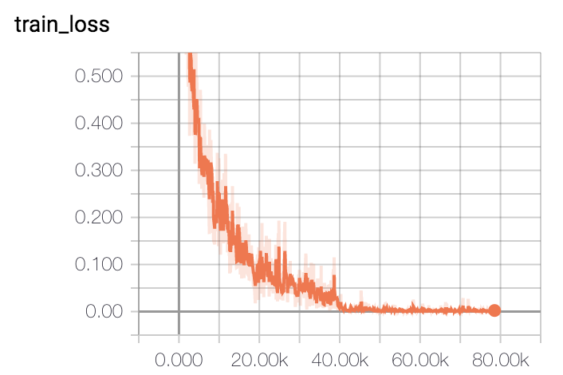

## Introduction

A Pytorch Implementation of ResNet(56-layers) trained on Cifar-10 with Accuracy of 92.07%.

- [X] train/evaluate model
- [X] Tensorboard
- [X] CPU/GPU version

## Train

+ from the scratch

    ```
    python train.py
    ```

+ restore from checkpoint

    ```
    python train.py --resume True --restore_path your_path
    ```

## Evaluate

+ evaluate from the default checkpoint
    
    ```
    python evaluate.py
    ```
    
+ evaluate from the specific checkpoint

    ```
    python evaluate.py --restore_path your_path
    ```

## PyTorch to ONNX

```
python model2onnx.py
```

## Onnx inference and evaluation

```
python onnx_infer.py
```

| | Accuracy | Time | 
| :---: | :---: | :---: |
| PyTorch | 0.9205 | 3.28 ms |
| ONNX (CPU) | 0.9205 | 0.73 ms |
| ONNX (GPU) | 0.9205 | 1.13 ms (slower ?) |
    

## Trt inference

```
cd trt_infer
cmake .
make
./trt_infer

```

以前10个图像为例，分析tensorrt模型的准确性，如下结果所示，结果都是正确的，但具体的分数有些没有对齐；分析原因发现是，保存的tiff和pytorch推理的数据不完全一致，使用pytorch推理保存的tiff数据，结果和trt推理的结果一致。

```
前10个图像: 
TRT结果 id score predition gt
0 -11.5148 -9.34448 0.978529 23.7355 1.67505 5.40225 4.08321 -2.0098 -6.92525 -5.79933 3 3
1 2.22357 16.388 -18.2045 -1.55752 -10.3169 -10.9391 -0.158681 -13.82 40.1693 -1.37983 8 8
2 -1.57638 7.09728 -2.30712 -12.2626 -3.34995 -5.27583 8.44791 -5.912 18.8735 -2.99757 8 8
3 15.5492 2.90727 2.13412 -1.37251 -13.7206 -11.5283 5.09328 -5.18727 7.92771 -0.824583 0 0
4 -7.32789 2.37433 7.74993 8.20302 -2.42306 -11.4556 32.5044 -18.6797 -6.5875 -4.36517 6 6
5 -6.54264 9.82332 -4.42987 -1.86258 -5.59243 -0.391409 22.3241 -8.71804 -0.647232 -2.77044 6 6
6 -7.56363 18.7323 -11.1065 2.47416 -1.80158 -0.949115 -0.0919326 0.080526 -10.7623 11.9376 1 1
7 7.96383 -6.80609 0.511945 2.21693 -9.99978 -1.75373 23.3924 -7.6296 -10.5811 2.67275 6 6
8 1.97407 -14.1761 -9.92203 31.7389 5.62722 15.8442 -6.66167 -3.36146 -11.3966 -10.0823 3 3
9 -5.51579 13.4957 -7.92075 -5.64635 -9.72553 -10.0195 3.77298 0.262676 11.4929 10.8836 1 1


PyTorch结果 id score predition gt
0 [ -9.412042   -4.6541157  -1.6993732  38.454075   -5.4147296  13.785398
   1.3177422  -7.2495413  -8.360564  -16.850412 ] 3 3
1 [  8.078031   19.9446    -18.470982   -8.583303  -11.011503   -9.48637
  -9.486442  -11.902594   41.479404    2.6041458] 8 8
2 [  3.3150811   16.872404    -6.9298286  -13.075735    -8.1335
  -3.9000692   -8.607382    -4.7552223   26.418613     0.90852517] 8 8
3 [ 23.452127     0.82416606   1.5440599   -0.25649822 -14.143656
 -12.096327    -4.8804684   -7.593973    10.430833     4.160478  ] 0 0
4 [-10.486675    2.6285448   8.462878    5.8767924  -4.8178797 -10.132528
  41.925518  -18.225927  -10.643624   -4.6984577] 6 6
5 [-14.591056    3.0535746  -3.2200232   2.6740065   1.3438965   1.2026962
  27.243835   -7.8320594  -7.8165226  -1.7393818] 6 6
6 [  0.8087214  25.898743   -9.236712    4.874936  -12.450614    0.6312697
  -4.062484   -4.997875  -12.364815   11.848455 ] 1 1
7 [ 4.7949247 -8.542366   5.3362665  1.0327704 -4.5680504 -3.8464224
 23.02463   -8.201792  -9.702179   0.4326473] 6 6
8 [ -7.3461566 -14.198172   -8.473996   35.625187   10.136464   19.164543
  -5.982458   -2.8230624 -15.45205   -11.232766 ] 3 3
9 [ -8.340147   26.636942  -10.9127     -6.699874  -14.5300255  -8.729122
   5.4461317  -3.831944    7.6034894  14.921452 ] 1 1
```

| | Time | 
| :---: | :---: |
| PyTorch | 3.28 ms |
| ONNX (CPU) | 0.73 ms |
| ONNX (GPU) | 1.13 ms (slower ?) |
| TensorRT | 0.80ms |

## Loss


    
## Reference

+ [https://github.com/akamaster/pytorch_resnet_cifar10](https://github.com/akamaster/pytorch_resnet_cifar10)
+ [https://blog.csdn.net/Teeyohuang/article/details/79210525](https://blog.csdn.net/Teeyohuang/article/details/79210525)
+ [使用ONNX进行部署并推理](https://datawhalechina.github.io/thorough-pytorch/%E7%AC%AC%E4%B9%9D%E7%AB%A0/9.1%20%E4%BD%BF%E7%94%A8ONNX%E8%BF%9B%E8%A1%8C%E9%83%A8%E7%BD%B2%E5%B9%B6%E6%8E%A8%E7%90%86.html)